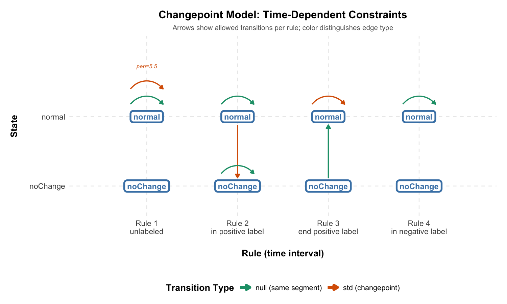
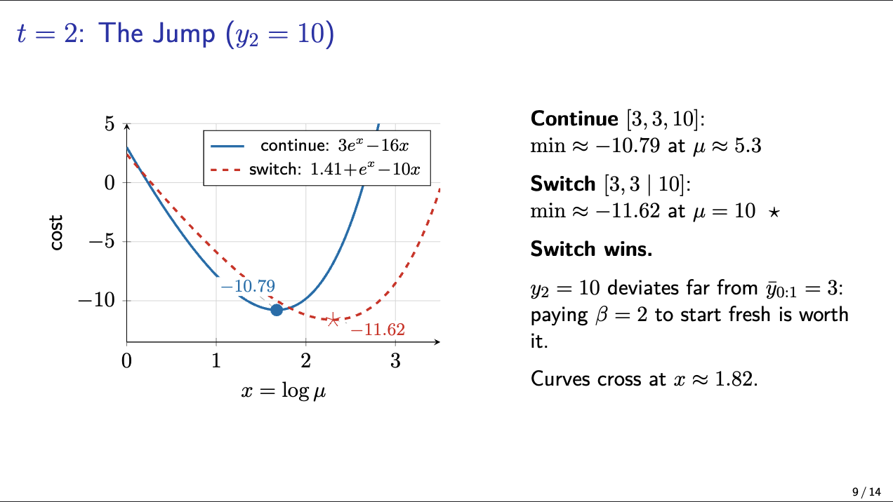
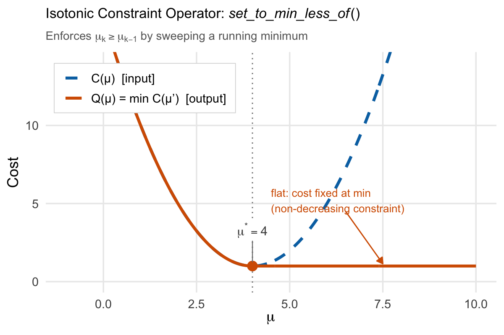

# GSoC 2026 — Time-Dependent Constraints in gfpop

This repository contains my attempts at the Easy, Medium, and Hard tests for the gfpop project.

---

## Progress

- ✅ Easy — `plotModel(graph)` visualization
- ✅ Medium — Unconstrained FPOP (Poisson loss)
- ✅ Hard — Regularized isotonic regression (Normal loss)

---

## Easy Test

I wrote the R function that takes a `gfpop::graph` (extended with a `rule` column) and visualizes the state–rule transition matrix using ggplot2.

Rows represent states, columns represent rules, and arrows indicate allowed transitions.

See [`1_easy/`](1_easy/) for code and instructions.

---

## Medium Test

I implemented the unconstrained FPOP solver for optimal partitioning with Poisson loss, adapting the `PeakSegOptimal` architecture from a 2-state constrained model to a 1-state unconstrained dynamic program. The implementation was validated against `Segmentor3IsBack`, matching its output with empirical $O(N)$ performance.

See [`2_medium/`](2_medium/) for code and usage instructions. I also prepared a short slide deck ([`algo.pdf`](2_medium/algo.pdf), compiled from `algo.tex`) walking through my current understanding of the FPOP pruning mechanics.

> Feedback or corrections are very welcome — I’m always looking to get a better understanding. :)

---

## Hard Test

The solution to the hard test is somewhat public. It sits in gfpop’s `src`. However, the operator depends on assumptions from the graph abstraction and piecewise cost structure, so using it outside that framework is not out-of-the-box plug-and-play.

I implemented the regularized isotonic regression solver for the Normal loss by reconstructing the core transformation in a simpler setting. The key operator, `set_to_min_less_of`, enforces the non-decreasing constraint by sweeping a running minimum over the piecewise quadratic cost, tracing the curve downhill and flattening at the minimum. With `penalty=0`, this matches the fitted values from `isoreg` (PAVA). Both `NormalLossPiece` and `PoissonLossPieceLog` inherit from a shared `LossPiece` base class for consistency across loss types.

See [`3_hard/`](3_hard/) for code, tests, and design notes.

---

## References

- Runge et al. (2020), *gfpop: Graph-Constrained Change-point Detection*  
  https://arxiv.org/abs/2002.03646
- Maidstone et al. (2017), *On Optimal Multiple Changepoint Algorithms for Large Data*  
  https://doi.org/10.1007/s11222-016-9636-3
- Hocking et al. (2022), *LOPART: Labeled Optimal Partitioning*  
  https://doi.org/10.1007/s00180-022-01238-z
- PeakSegOptimal (GitHub)  
  https://github.com/tdhock/PeakSegOptimal
- Segmentor3IsBack (CRAN)  
  https://cran.r-project.org/package=Segmentor3IsBack
- gfpop (GitHub)  
  https://github.com/vrunge/gfpop
- Barlow et al. (1972), *Statistical Inference under Order Restrictions* — isotonic regression reference
- `isoreg` (R base) — used for Hard test validation  
  https://stat.ethz.ch/R-manual/R-devel/library/stats/html/isoreg.html